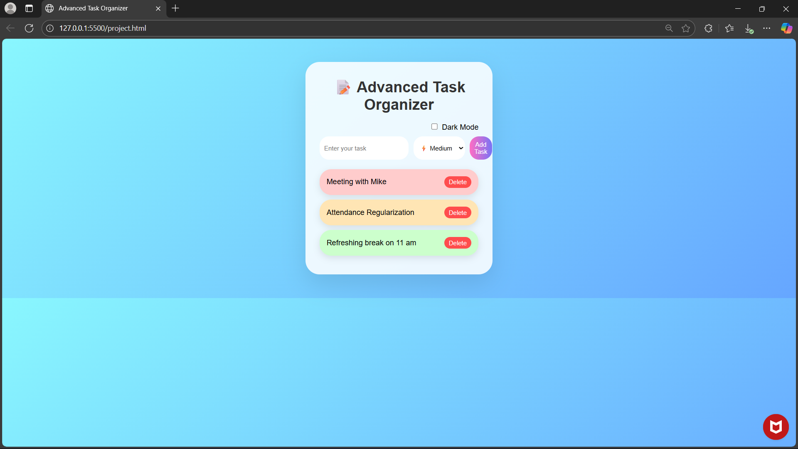
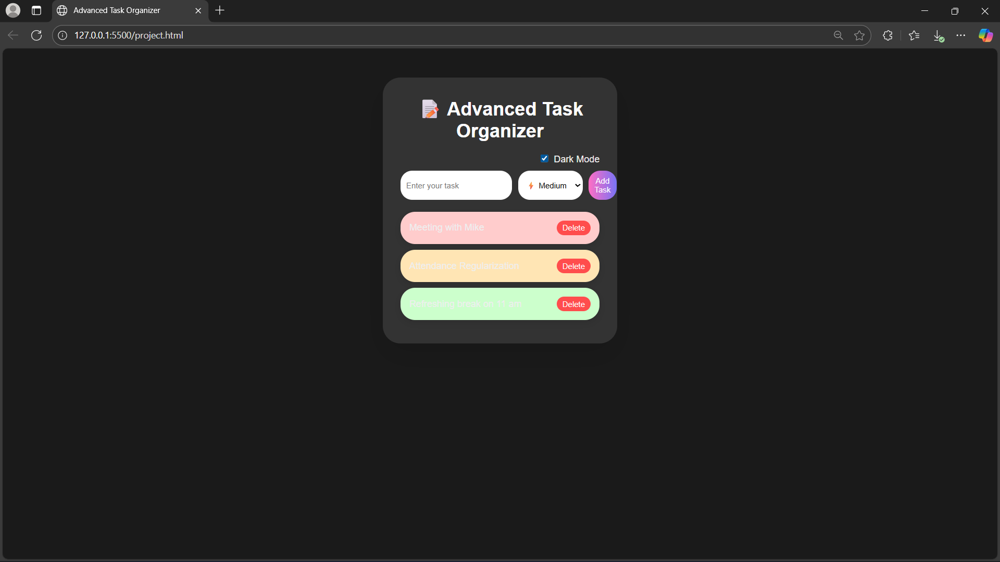
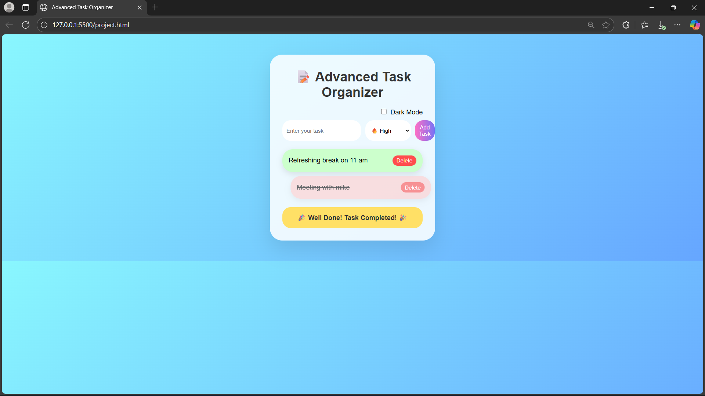

# 📝 Smart Task Organizer

A modern and interactive **task management web app** built with **HTML, CSS, and JavaScript**.  
This project helps users organize tasks with priorities, track progress, and stay productive with a stylish UI.

---

## 🚀 Features
- ✅ Add, edit, and delete tasks  
- 🎯 Set **priority levels** (High, Medium, Low) with colorful curved task boxes  
- ✨ Drag-and-drop tasks to reorder  
- 🌙 **Dark/Light mode toggle**  
- 🎉 Animated **“Well Done” message** on task completion  
- 💾 Tasks are saved in **localStorage** (persistent even after refresh)  
- 🖱️ Custom cursor and smooth hover effects  

---

## 🖼️ Screenshots
### Light Mode


### Dark Mode


### Task Completed



---

## 🛠️ Tech Stack
- **HTML5**  
- **CSS3** (Flexbox, Gradients, Animations)  
- **JavaScript (ES6+)**

---

## ⚡ How to Run Locally
1. Clone the repository:
   ```bash
   git clone https://github.com/<Karishma203>/smart-task-organizer.git
